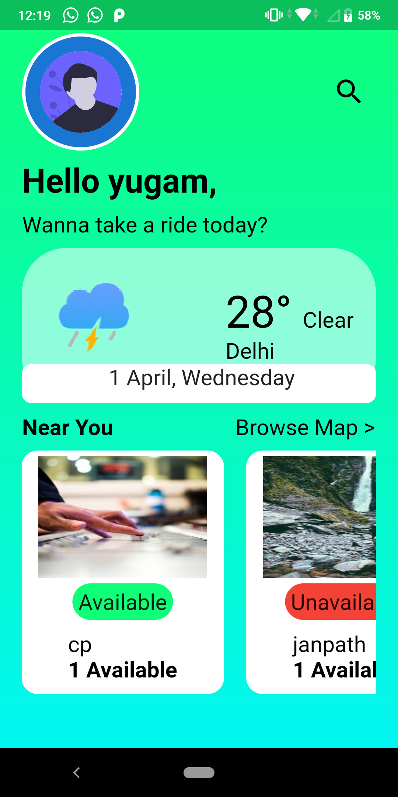
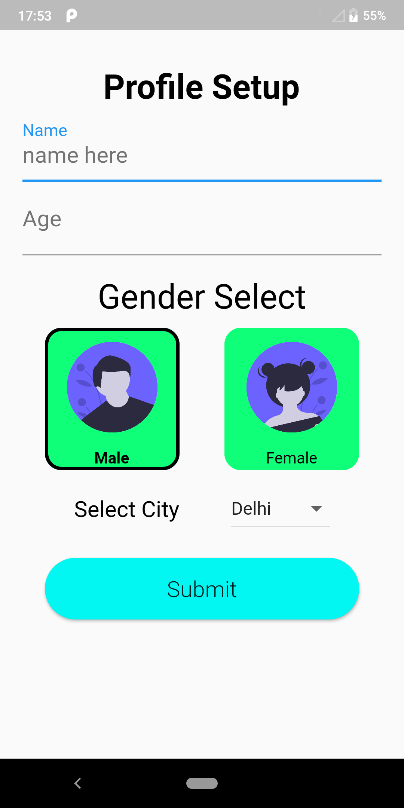

# wheels_on_lease

A very basic Flutter project for renting vehicles. 

## features

Firebase email authentication 
Main Screen UI 
Profile Screen 

    
    
Login Screen

    
    
Signin Screen

    
    
Main Screen

    
    
Profile Screen

